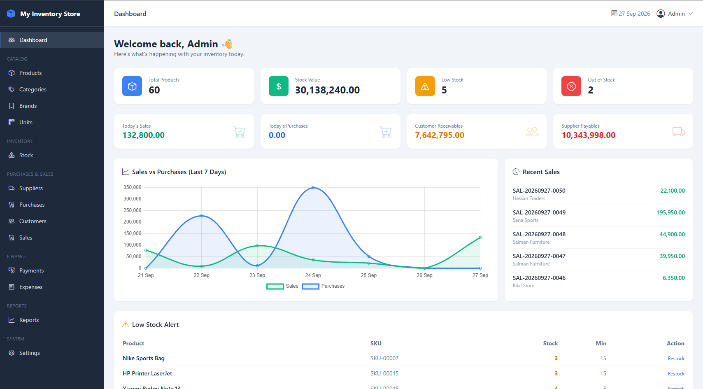
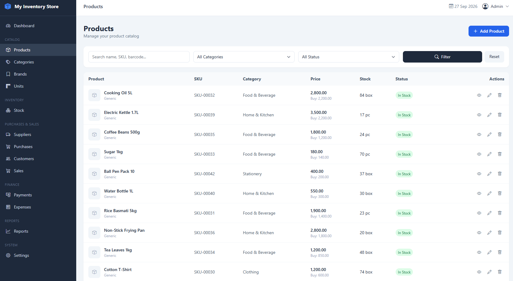
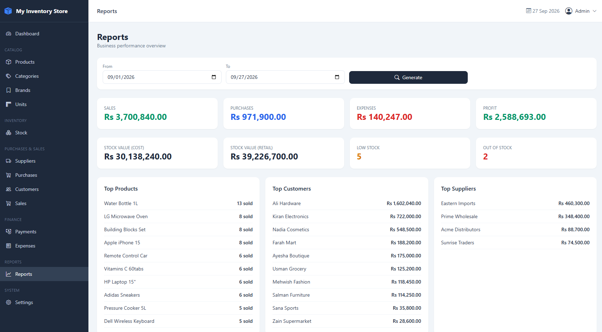
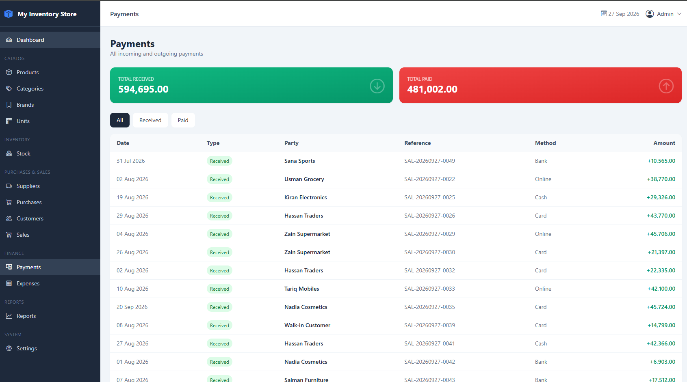
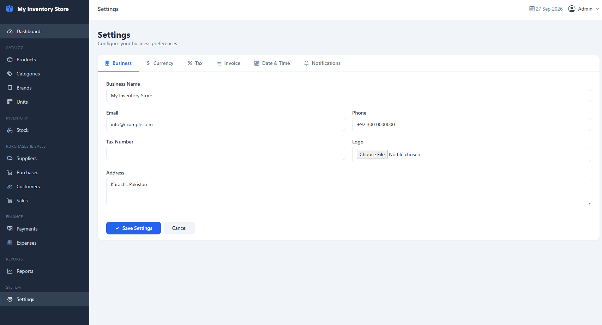

# 📦 Inventory Management System

A modern, open-source **Inventory Management System** built with **Laravel 12**, **Tailwind CSS 4**, and **Alpine.js**. Designed for small to medium businesses to manage products, stock, purchases, sales, customers, suppliers, and more.

[](LICENSE)
[](https://www.php.net)
[](https://laravel.com)
[](https://tailwindcss.com)
[](CONTRIBUTING.md)

---

## 📖 Table of Contents

- [Features](#-features)
- [Screenshots](#-screenshots)
- [Tech Stack](#-tech-stack)
- [Requirements](#-requirements)
- [Installation](#-installation)
- [Default Login](#-default-login)
- [Project Structure](#-project-structure)
- [Roadmap](#-roadmap)
- [Contributing](#-contributing)
- [License](#-license)

---

## ✨ Features

### Core Modules
- 📊 **Dashboard** — live stats, 7-day sales/purchase chart, low-stock alerts, recent sales
- 📦 **Products** — SKU, barcode, images, category, brand, unit, purchase/selling price, tax, minimum stock
- 🏷️ **Categories** — CRUD with product count & active toggle
- 🔖 **Brands** — CRUD with product count
- 📏 **Units** — Piece, Kg, Box, Litre, Dozen
- 🚚 **Suppliers** — profiles, contact info, balance tracking, purchase history
- 👥 **Customers** — profiles, credit limits, receivables
- 🛒 **Purchases** — multi-item orders, partial payments, auto stock update, printable invoice
- 💰 **Sales** — multi-item invoices, discounts, taxes, auto stock deduction, partial payments
- 📉 **Inventory** — current stock list, movement log, manual adjustments (in/out/set exact)
- 💸 **Expenses** — categorized, filterable, monthly reporting
- 💳 **Payments** — unified timeline (customer payments received + supplier payments made)
- 📈 **Reports** — P&L, stock valuation, top products/customers/suppliers
- ⚙️ **Settings** — business info, logo, currency, tax, invoice prefix, notifications

### Under the Hood
- ✅ Stock movement audit trail for every change
- ✅ Supplier & customer balance auto-update on purchase/sale/payment
- ✅ Partial and full payment support
- ✅ Search, filters, and pagination on all lists
- ✅ Responsive Tailwind UI
- ✅ Cached settings via key-value store
- ✅ Demo data seeder — 60 products, 50 sales, 25 purchases, 30 expenses

---

## 🖼️ Screenshots

> Screenshots coming soon — add yours after first run under `docs/screenshots/`.

| Dashboard | Products | Sales |
|-----------|----------|-------|
|  |  |  |

| Purchases | Inventory | Reports |
|-----------|-----------|---------|
|  |  |  |

---

## 🛠️ Tech Stack

| Layer | Tech |
|-------|------|
| Backend | Laravel 12 · PHP 8.4 |
| Frontend | Blade · Tailwind CSS 4 · Alpine.js |
| Build | Vite 8 |
| Database | MySQL 8 / MariaDB 10.4+ |
| Auth | Laravel Breeze |
| Icons | Bootstrap Icons |
| Charts | Chart.js |

---

## 💻 Requirements

- **PHP** ≥ 8.2 (8.4 recommended)
- **Composer** ≥ 2.5
- **Node.js** ≥ 18 & **npm** ≥ 9
- **MySQL** ≥ 8 or **MariaDB** ≥ 10.4
- **Git**

---

## 🚀 Installation

### 1. Clone the repository

```bash
git clone https://github.com/aimages08/inventory-system.git
cd inventory-system
```

### 2. Install dependencies

```bash
composer install
npm install
```

### 3. Configure environment

```bash
cp .env.example .env
php artisan key:generate
```

### 4. Create the database

Open phpMyAdmin or MySQL CLI:

```sql
CREATE DATABASE inventory_db CHARACTER SET utf8mb4 COLLATE utf8mb4_unicode_ci;
```

Update `.env`:

```env
DB_DATABASE=inventory_db
DB_USERNAME=root
DB_PASSWORD=
```

### 5. Run migrations + seed demo data

```bash
php artisan migrate:fresh --seed
php artisan storage:link
```

### 6. Build frontend assets

```bash
npm run build
```

For development:

```bash
npm run dev
```

### 7. Serve the app

```bash
php artisan serve
```

Open **http://localhost:8000**

---

## 🔑 Default Login

The seeder creates a demo admin account:

| Field | Value |
|-------|-------|
| **Email** | `admin@example.com` |
| **Password** | `password` |

> ⚠️ **Change these credentials immediately in production.**

To reset the seeded user manually:

```bash
php artisan tinker
```

```php
\App\Models\User::where('email', 'admin@example.com')->update([
    'password' => \Illuminate\Support\Facades\Hash::make('new-password'),
]);
```

---

## 📁 Project Structure

```
app/
├── Helpers/
│   └── helpers.php              # setting() and money() helpers
├── Http/
│   ├── Controllers/             # One controller per module
│   └── Requests/                # Form validation
├── Models/                      # Eloquent models
└── Services/                    # Business logic
    ├── PurchaseService.php
    ├── SaleService.php
    └── StockService.php

database/
├── migrations/
└── seeders/
    ├── AdminUserSeeder.php      # Default admin user
    ├── SettingsSeeder.php       # Default settings
    └── CatalogSeeder.php        # Demo products/sales/purchases

resources/views/
├── layouts/
│   └── app.blade.php            # Master layout
├── dashboard.blade.php
├── products/  categories/  brands/  units/
├── suppliers/  customers/
├── purchases/  sales/
├── inventory/  expenses/  expense-categories/
├── payments/  reports/  settings/
└── vendor/pagination/           # Custom Tailwind pagination

routes/
└── web.php                      # All routes
```

---

## 🗺️ Roadmap

- [x] **v1.0.0** — MVP: Products, Purchases, Sales, Inventory, Reports, Settings
- [ ] **v1.1.0** — Barcode generation & scanning
- [ ] **v1.2.0** — Multi-warehouse support
- [ ] **v1.3.0** — Users & Roles (Spatie permissions)
- [ ] **v1.4.0** — Invoice PDF (A4 + thermal)
- [ ] **v1.5.0** — Import / Export (Excel, CSV)
- [ ] **v1.6.0** — REST API for POS / e-commerce
- [ ] **v2.0.0** — Docker setup + live demo

---

## 🤝 Contributing

Contributions are welcome! Please read [CONTRIBUTING.md](CONTRIBUTING.md) first.

Quick steps:

```bash
git checkout -b feature/my-feature
git commit -m "feat: add my feature"
git push origin feature/my-feature
```

Then open a Pull Request.

---

## 🐛 Reporting Bugs

Use the [issue tracker](https://github.com/aimages08/inventory-system/issues). Include:
- Laravel + PHP + MySQL versions
- Steps to reproduce
- Expected vs actual behavior
- Screenshots / logs

---

## 📜 License

Released under the [MIT License](LICENSE).

---

## 🙏 Acknowledgements

- [Laravel](https://laravel.com)
- [Tailwind CSS](https://tailwindcss.com)
- [Alpine.js](https://alpinejs.dev)
- [Bootstrap Icons](https://icons.getbootstrap.com)
- [Chart.js](https://www.chartjs.org)

---

## ⭐ Support

If this project helped you, please give it a ⭐ — it means a lot!

---


## 🖼️ Screenshots

### 📊 Dashboard — Live stats, 7-day chart, low-stock alerts


### 📦 Products — Full CRUD with search, filters, pagination


### 📈 Reports — Profit & loss, stock valuation, top lists


### 💳 Payments — Unified timeline of received & paid


### ⚙️ Settings — Business info, currency, tax, invoice



Made with ❤️ by [webnexasoftweb](https://github.com/aimages08)